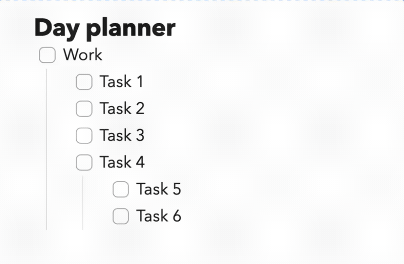

# Reorderable Lists

An [Obsidian](https://obsidian.md) plugin that lets you drag and drop list items to reorder them in the editor.

## Features

- Drag handle (⠿) appears on hover for any list item
- Works with all list types: unordered (`-`, `*`, `+`), ordered (`1.`), and task lists (`- [ ]`)
- Nested children move together with their parent item
- Preserves scroll position after reordering
- Live Preview editor only (desktop)

## Usage

1. Hover over any list item — a ⠿ grip icon appears to the left
2. Drag the handle to move the item to a new position
3. A blue line indicates where the item will be dropped
4. Release to reorder



## Installation

### From Obsidian Community Plugins (recommended)

1. Open **Settings → Community Plugins**
2. Disable Safe Mode if prompted
3. Click **Browse** and search for "Reorderable Lists"
4. Click **Install**, then **Enable**

### Manual

1. Download `main.js`, `manifest.json`, and `styles.css` from the [latest release](../../releases/latest)
2. Copy them into your vault at `.obsidian/plugins/reorderable/`
3. Enable the plugin in **Settings → Community Plugins**

## Development

```bash
git clone https://github.com/hosikiti/obsidian-reorderable-lists
cd obsidian-reorderable-lists
npm install
npm run dev   # watch mode
npm run build # production build
```

To test locally, symlink or copy the plugin folder into your vault's `.obsidian/plugins/` directory.

## License

MIT
